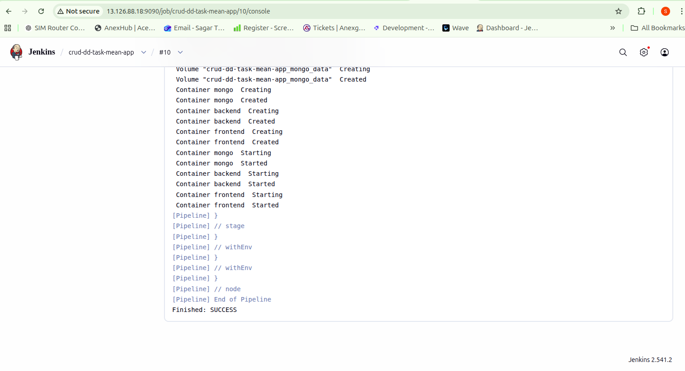
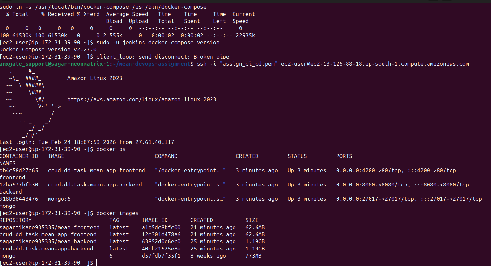
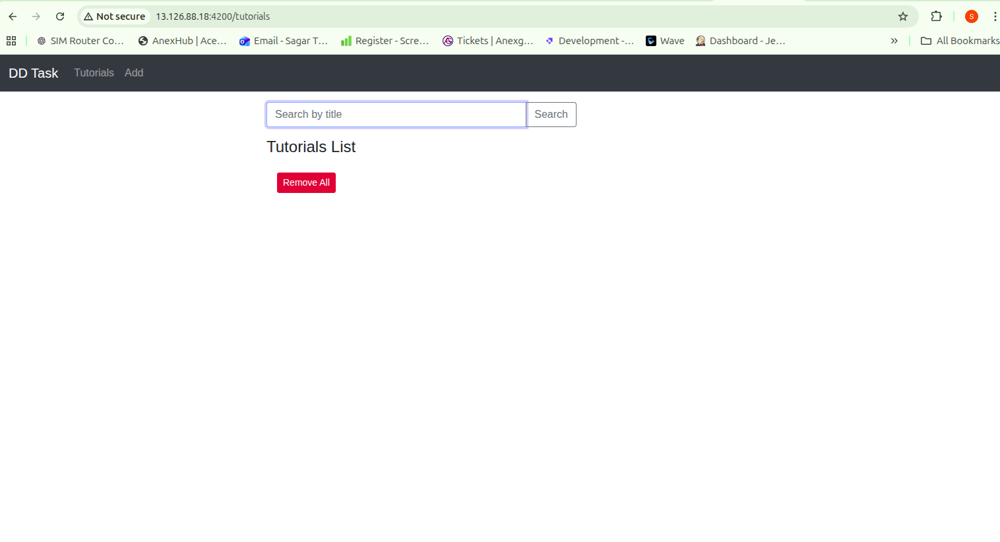
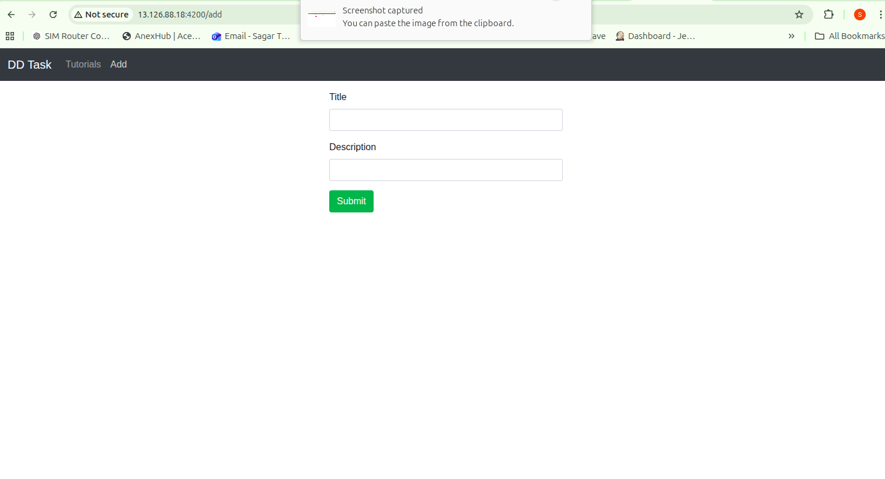

## Jenkins Pipeline

Pipeline executed successfully with all stages completed.

---

## Docker Images in DockerHub

Both frontend and backend images pushed successfully.

---

## Running Containers on EC2

All containers are up and running.

---

## Application Working UI

CRUD operations working properly.

